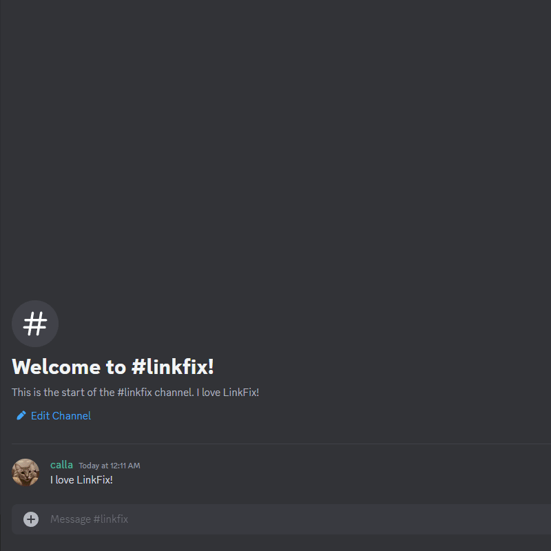

# LinkFix for Discord

[![Bot status badge][9]][1]

[![GitHub Actions linting workflow badge][5]][4] [![ghcr.io release badge][6]][3] [![support server badge][7]][8] [![Vote for LinkFix on Top.gg][12]][11]

<div align="center">
  
  <p><em>erm... your link, my liege</em></p>
  <h2><a href="https://discord.com/oauth2/authorize?client_id=385950397493280805&scope=bot&permissions=274878286912">:arrow_forward: Click Here to add LinkFix to your Discord server! :arrow_backward:</a></h2>
</div>


## What is LinkFix?

LinkFix brings link embeds back to your Discord server!



Rich media embeds are not well supported by large social media sites. For example,
Tweets (a.k.a. "Posts") from Twitter/X no longer embed in Discord. LinkFix solves
this problem by replying to messages containing such links with vxtwitter-style
alternatives that support rich media embeds.


## Supported Sites

LinkFix currently supports:
  - Twitter/X (Tweet embeds via [fxtwitter](https://github.com/FixTweet/FixTweet))
  - TikTok (video embeds via [vxtiktok](https://github.com/dylanpdx/vxtiktok))
  - Instagram (image, video, and reel embeds via [ddinstagram](https://github.com/Wikidepia/InstaFix))
  - Reddit (text, image, and video embeds via [vxreddit](https://github.com/dylanpdx/vxReddit))
  - YouTube Shorts (replies with a `youtu.be` URL that directs to the full player)


## Current Commands

  - `/help`: Displays a help message with this list of commands
  - `/invite`: Get a link to invite LinkFix to a server
  - `/vote`: Get a link to [vote for LinkFix on Top.gg][10]

## Contributing

### Local Development

Follow these steps to get the code up and running:

1) Clone the repo :hugs:
2) Run `npm install`
3) Copy `.env.example` to `.env`
4) Set `DISCORD_BOT_TOKEN=` in `.env` to your bot token
5) Run `npm run build && npm start`. You're good to go!

Alternatively, with Docker Compose:

1) Follow steps 1 and 2 above
2) Copy `docker-compose.example.yml` to `docker-compose.yml`
3) Edit `docker-compose.yml`
   a) Change the line `image: ...` to `build: .`
   b) Set `DISCORD_BOT_TOKEN=` to your bot token
4) Run `docker-compose up --no-log-prefix`. You're good to go!


### Pull Requests

Please write a detailed description for your PR! Also note commit messages will
be squashed as part of the merge. PRs must pass all automated checks to qualify
for a merge.


## License

```
LinkFix for Discord - A Discord bot for improving link embeds.
Copyright (C) 2023  Ralph and suchipi

This program is free software: you can redistribute it and/or modify
it under the terms of the GNU Affero General Public License as published by
the Free Software Foundation, either version 3 of the License, or
(at your option) any later version.

This program is distributed in the hope that it will be useful,
but WITHOUT ANY WARRANTY; without even the implied warranty of
MERCHANTABILITY or FITNESS FOR A PARTICULAR PURPOSE.  See the
GNU Affero General Public License for more details.

You should have received a copy of the GNU Affero General Public License
along with this program.  If not, see <https://www.gnu.org/licenses/>.
```

See [`LICENSE.txt`](/LICENSE.txt) for the full license details.


[1]: https://discord.com/application-directory/385950397493280805
[2]: https://discordjs.guide/preparations/setting-up-a-bot-application.html#creating-your-bot
[3]: https://github.com/podaboutlist/linkfix-for-discord/pkgs/container/linkfix-for-discord
[4]: https://github.com/podaboutlist/linkfix-for-discord/actions?query=branch%3Amain
[5]: https://img.shields.io/github/actions/workflow/status/podaboutlist/linkfix-for-discord/release.yml?style=plastic&logo=github&label=code%20style&labelColor=24292e&event=push
[6]: https://img.shields.io/github/actions/workflow/status/podaboutlist/linkfix-for-discord/release.yml?style=plastic&logo=github&label=ghcr.io%20release&labelColor=24292e
[7]: https://img.shields.io/discord/643644919751376899?style=plastic&logo=discord&logoColor=%23ffffff&label=Support%20Server&labelColor=%2324292e&color=%235961ee&cacheSeconds=60
[8]: https://podaboutli.st/discord
[9]: https://dcbadge.vercel.app/api/shield/385950397493280805?bot=true&style=for-the-badge&theme=discord-inverted&labelColor=%2324292e
[10]: https://top.gg/bot/385950397493280805/vote
[11]: https://top.gg/bot/385950397493280805/vote
[12]: https://img.shields.io/badge/Top.gg-Vote%20for%20LinkFix!-24292e?style=plastic&logo=data:image/svg%2bxml;base64,PHN2ZyB4bWxucz0iaHR0cDovL3d3dy53My5vcmcvMjAwMC9zdmciIHZlcnNpb249IjEiIHZpZXdCb3g9IjEyMCAxMjAgNTgwIDU4MCI+IDxwYXRoIGZpbGw9IiNmZmYiIGQ9Ik02NTUuNzExIDI0N0gzMzAuNzFWNTcySDM5Ny4xMTNDNDIyLjU5OSA1NzIgNDQ3LjA0MiA1NjEuODc2IDQ2NS4wNjQgNTQzLjg1NEM0ODMuMDg2IDUyNS44MzIgNDkzLjIxIDUwMS4zODkgNDkzLjIxIDQ3NS45MDJWNDA5LjVINTU5LjYxM0M1ODUuMDk5IDQwOS41IDYwOS41NDIgMzk5LjM3NSA2MjcuNTY0IDM4MS4zNTRDNjQ1LjU4NiAzNjMuMzMyIDY1NS43MTEgMzM4Ljg4OSA2NTUuNzExIDMxMy40MDJWMjQ3WiI+PC9wYXRoPjxwYXRoIGZpbGw9IiNmZmYiIGQ9Ik0xNDQgMjQ3SDMwNi41VjQwOS41SDE5My42NTdDMTgwLjUzMSA0MDkuNSAxNjcuOTQzIDQwNC4yODYgMTU4LjY2MSAzOTUuMDA0QzE0OS4zNzkgMzg1LjcyMiAxNDQuMTY1IDM3My4xMzQgMTQ0LjE2NSAzNjAuMDA4TDE0NCAyNDdaIj48L3BhdGg+PC9zdmc+Cg==&labelColor=ff3366
